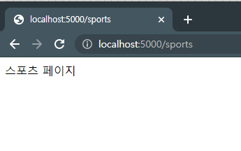

# Web Programming


- 클라이언트가 HTTP나 HTTPS프로토콜을 이용해서 서비스를 받을 수 있도록 프로그래밍 하는 것


## 1. 웹 서버에 요청하는 방법

- 웹 브라우저를 이용한 요청
- 클라이언트 용 프로그램을 제작해서 요청


## 2. 요청을 하기 위한 URL구조

`프로토콜://[호스트 - 도메인이나 IP주소][:PORT][요청]?[파라미터]`

- 프로토콜 : http 또는 https
- PORT : 프로토콜의 기본포트를 사용하는 경우는 생략 가능
  - 기본 포트 : HTTP는 80, HTTPS는 443
- 요청 : 파일명이 아님. 요청 경로는 서버에서 처리를 하는 문장이 있기 때문에 생략가능
- 파라미터 : 클라이언트가 웹 서버에 전달하는 데이터로 `이름=값&이름=값` 의 형태로 전송
- 마지막에 #이 붙는 경우 : Frament라고 하는데 문서 내의 특정 위치로 이동할 때 사용


## 3. 웹프로그래밍의 결과


### 1) 정적인 페이지

- 요청이 오면 항상 동일한 내용을 출력하는 페이지
- 이 경우는 별도의 서버 처리 코드가 필요 없음
- HTML, CSS, JavaScript로만 구성


### 2) 동적 페이지

- 요청이 오면 서버가 처리해서 결과를 동적으로 출력하는 페이지
- Java나 Python 등과 같은 서버 사이드 프로그래밍 언어를 이용해서 별도의 서버 프로그램을 작성해야 함


## 4. 동적 페이지를 만들어내는 방식


### 1) CGI 방식 

- 클라이언트의 요청을 하나의 프로세스로 처리하는 방식입니다.
- Perl이 이 방식을 사용합니다.


### 2) 애플리케이션 서버 방식

클라이언트의 요청을 하나의 스레드로 처리하는 방식

- 동시에 여러 클라이언트의 요청을 처리하는 것이 가능
- Java로 만들면 JSP로, Python , C#(ASP.Net), PHP, Ruby 등으로 작성
- 우리나라는 Java를 많이 이용했습니다.
- 간단한 웹 사이트는 PHP나 Node등을 이용해서 많이 작성합니다


## 5.웹 프로그래밍의 구조


`사용자 애플리케이션 <-->Web Werver <--> Application Server <--> Repository`

- 사용자 애플리케이션을 만드는 것을 Front End라고 합니다.
- Application Server를 만드는 것을 Back End 또는 Server Side Programming 이라고 합니다.

- 사용자 애플리케이션이 웹 브라우저에서 동작하도록 하려면 HTML, CSS, JavaScript를 이용해야 합니다.
  - HTML : 웹 브라우저에 출력할 문서의 구조를 만드는 언어
  - CSS : HTML에 디자인을 입히는 것. 최근에 이 문법을 이용해서 GUI Programming의 디자인도 설정합니다. pyqty나 java sess도 css로 디자인 설정 가능
  - Javascript : HTML에 동적인 기능을 부여하기 위한 언어. 최근에는 JavaScript로 여러 라이브러리를 개발해서 다양한 용도로 사용됩니다.


## 6. Python 웹 프레임워크


### 1) Django : Full Stack Framework

 - Full Stack : 클라이언트와 서버를 전부 개발하는 것. 


- MEA(R)N : 클라이언트와 서버를 JavaScript로 전부 구현합니다.
  - Mongo DB : 저장소
  - Express.js : 웹 서버의 역할
  - Angular.js(React.js) : 클라이언트 프로그래밍
  - Node.js : 애플리케이션 서버


- 자체 ORM기능 제공
    - ORM(Object Relation Mapping) : 데이터베이스 연동을 할 때 하나의 클래스와 테이블을 매핑해서 클래스의 인스턴스를 이용해서 데이터베이스 작업을 수행하는 것으로 SQL이 필요없습니다.
    - SQL을 직접 이용하게 되면 데이터베이스 마다 SQL이 조금씩 다르기 때문에 특정 데이터베이스 연동을 하는 코드를 작성한 상태에서 데이터베이스를 변경하면 코드도 수정해야 합니다. 그래서 데이터베이스를 함부로 바꿀 수 없습니다.


- 기본적인 틀을 제공


### 2) Flask : Micro Framework

- 하나의 프로젝트에 하나의 Application 만 생성 가능합니다.
- 별도의 ORM이 없습니다
- 틀이 제공되지 않아서 편하게 확장이 가능합니다


# Flask

- 웹개발을 할 때 jupyter notebook보다는 pycham을 많이 사용합니다.


## 1.특징

- Python 기반 Micro Web Framework
- 확장성 있는 설계를 지원합니다
- Linked in 이 대표적인 Flask로 구현한 웹 애플리케이션입니다
- 페이스북이 Flask으로 만들어졌으며 Flask로 충분히 큰 프로젝트를 만들 수 있습니다.


## 2.설치 : flask

- pycharm 설치
  - pycharm은 나중에 배포를 위해서 기본적으로 가상환경을 만듭니다. 
- flask docs-kr : [https://flask-docs-kr.readthedocs.io/ko/latest/](https://flask-docs-kr.readthedocs.io/ko/latest/)

- 1. **Pycharm**을 실행하고 아까 만든 '프로젝트' 디렉토리 myproject를 열어줍니다
  2. **PyCharm** 화면 우측상단 File -> Setting에서 Python Interpreter를 설정해줍니다


## 3 실행 


### 1) 기본 실행 소스코드 

📃​​ main.py

```python
# / 요청이 오면 처리하는 코드
# / 요청은 도메인과 포트 번호까지만 입력된 경우
@app.route('/')
def main():
    return 'Hello Flask!'

# 서버를 테스트 용으로 실행
# host를 127.0.0.1로 작성하면 로컬에서만 접속이 가능
# 0.0.0.0 으로 작성하면 모든 곳에서 접속이 가능합니다.
# port를 생략하면 5000번 포트를 할당합니다.
# Threaded 를 True로 설정하면 스레드로 요청을 처리합니다.(스레드는 동시에 여러 클라이언트 처리가능)
# 개발을 할 때는 debug를 True로 설정하지만 운영을 할 때는 반드시 False로 변경합니다.
app.run(host = '0.0.0.0')
```

- host

  - host를 127.0.0.1로 작성하면 로컬에서만 접속이 가능합니다

- debug

  - 개발을 할 때 debug를 True로 설정하면 재실행을 하지 않아도 바로 수정내용이 반영됩니다.

    **하지만 운영배포할 때는 반드시 False로 변경해야 합니다.**
    
    ```python
       app.run(host = '0.0.0.0', debug=True)
    ```

- Threaded
  - True로 설정하면 스레드로 요청을 처리합니다. (스레드는 동시에 여러 클라이언트 처리가 가능합니다.)

- host
  - 0.0.0.0 으로 작성하면 모든 곳에서 접속이 가능합니다.
- port
  - port를 생략하면 5000번 포트를 할당합니다.

:file_folder:templates/📃index.html

```html
<!DOCTYPE html>
<html lang="en">
<head>
    <meta charset="UTF-8">
    <title>제목</title>
</head>
<body>

</body>
</html>
```


### 2) 접속

- 코드를 실행한 후 브라우저에서 [localhost:5000](localhost:5000) 으로 접속
  localhost대신에 [127.0.0.1](127.0.0.1) 이라고 써도 되고 컴퓨터의 IP를 써도 됩니다

- 테스트가 아니고 배포를 한 경우 실행
  `flask run --host=0.0.0.0`  이라는 명령을 수행
  이경우는 시작 파일 이름이 app.py이어야 합니다
- 파일 이름을 바꾸고자 하는 경우는 환경 변수에 FLASK_APP 이라는 속성에 파일명을 설정해야 합니다


## 3 URL 처리


```python
@app.route('요청 주소')
def 함수이름:
    내용 작성  
```

- 요청 주소가 서버에 도달하면 함수를 실행하고 결과를 출력

📃 main.py

```python
@app.route('/sports')
def sports():
    return '스포츠 페이지'
```

웹 브라우저에서 `http://localhost:5000/sports`에 접속




### 1) URL의 일부분을 변수로 사용하기

- 최근의 웹 프로그래밍(블로그형 게시판의 상세보기)에서 많이 이용됩니다.

  뉴스기사 상세 화면 : https://www.bloter.net/newsView/blt202108230018

  - 상세보기를 변수로 사용하여 데이터베이스에서 글의 상세 내용을 찾아옵니다.

- `/URL/<변수이름>`의 형태로 작성합니다


📃 main.py

```python
# <변수>
@app.route('/bloter/<title>')
def bloter(title):
    return title
```


웹 브라우저에서 `http://localhost:5000/bloter/아무거나`에 접속


- 앞에 int:나 float:을 추가하면 형 변환도 수행해 줍니다.

```python
@app.route('/tistory/<int:num>')
def tistory(num):
    return str(num)
```

웹 브라우저에서 `http://localhost:5000/tistory/2`에 접속


## 4.HTML

### 1) HTML의 구성

요즘엔 HTML의 태그 뿐만 아니라 애플리케이션을 만들 수 있는 기능들을 공부해야 합니다.

:file_folder:templates/📃index.html

````html
<html>
    <head>
        <!-- 문서에 대한 설정 -->
        <meta charset='UTF-8'>
        <title>문서의 제목</title>
        <!-- css는 문서에 디자인을 적용 -->
       	<style>
            h1 {
                color:red;
            }
        </style>
    </head>
    <body>
        <!-- 브라우저에 보여지는 부분을 설정-->
        <h1 id='content'>문서에서 보여지는 부분</h1>
    </body>
    <script>
	<!-- JavaScript에 대한 설정 -->
    	document.getElementById('content').innerHTML = '내용변경'
    </script>
</html>
````


## 5.Parameter 처리

- Parameter:클라이언트가 서버에게 전송하는 데이터
- 처리하는 내부에서는 Parameter말 대신에 Argument라는 용어를 사용합니다
- Web Programming에서는 Query String이라고 하기도 합니다.


### 1) Prameter 전송 방식

#### get 방식

- 파라미터를 URL뒤에 붙여서 전송합니다
- URL 뒤에 `이름 = 값 & 이름 = 값`의 형태로 전송
- 글자 수에 제한이 있고 보안이 안되므로 비밀번호 등의 중요한 정보는 이 방법으로 전송하면 안됩니다.
- get의 장점은 자동 재전송 기능이 있다는 것입니다.


#### post 방식

- 파라미터를 요청의 헤더에 숨겨서 전송

- form 을 이용하거나 javascript를 이용해서 전송

- 글자 수에 제한이 없고 보안이 우수합니다

  ##### put 

  - post와 동일합니다

  ##### delete 

  - post와 동일합니다


#### 요즘의 post방식

- 최근의 웹 프로그래밍에서는 다음과 같이 요청을 명확하게 구분합니다.
  - 데이터를 삽입하는 경우는 post
  - 수정하는 경우는 put
  - 삭제하는 경우는 delete


### 2) 파라미터 처리방법

- `request`라는 전역 객체를 이용
- `request.method`를 호출하면 파라미터 전송 박식이 문자열로 리턴됩니다.
  요청을 처리할 때 methods에 처리방식을 기재하면 처리 방식이 맞을 때만 함수가 호출됩니다.
- `request.form`을 호출하면 파라미터를 MultiDict로 리턴합니다.
  단, 파일이 포함된 경우는 files를 호출해야 합니다.
- `request.args`는 ulr에 넘어온 파라미터를 MultiDict로 리턴합니다.
- `cookies` : 쿠키 정보를 리턴
  쿠키는 인터넷 사용정보를 브라우저에 저장 -> 서버가 요청하면 서버가 가져감 => 보안성이 떨어졌었음
  해외 사이트를 사용하다 보면, 쿠키 사용에 동의하는지 물어봄
- `headers` : 헤더 정보를 리턴
- 구현순서는 클라이언트 -> 서버 또는 서버->클라이언트


## 6.템플릿 엔진

- flask에서는 `render_template('출력할 파일의 경로')`를 요청 처리 메소드가 리턴하면 파일을 출력할 수 있습니다.
- 기본적으로는 :file_folder:templates 디렉토리에 파일이 존재해야 합니다.
- :file_folder:templates는 출력할 파일이라고 생각하면 됩니다.


### 1) get 방식

📃 main.py

```python
@app.route('/search')
def search():
    # 문자열 반환 : html에 글씨 표시
    # request는 전역객체이므로 안만들어도 존재
    # html의 name에 설정한 값을 form['']에 설정
    keyword = request.form['keyword']
    return keyword
```


:file_folder:templates/📃index.html

```html
<!DOCTYPE html>
<html lang="en">
<head>
    <meta charset="UTF-8">
    <title>파라미터 처리</title>
</head>
<body>
    <h1>get 방식 요청을 전송하는 FORM</h1>
    <!--action="요청 주소"-->
    <form action="/search" method="get">
        검색어<input type="text" name="keyword"/>
        <input type="submit" value="검색" />
    </form>
</body>
</html>
```

웹브라우저에서 `http://localhost:5000/`에 접속


검색어 창에 문자열을 입력 - 검색 버튼 클릭

입력한 문자열이 브라우저에 나와야 하는데 에러가 납니다.


get방식으로 전송된 데이터가 form에 있더라도 `request.form[]`이 아닌 `request.args[]`라고 써줘야 합니다.

📃 main.py

```python
@app.route('/search')
def search():
    # get방식으로 전송된 데이터가 form에 있더라도 request.form[]이 아닌 request.args[]라고 써줘야 합니다.
    keyword = request.args['keyword']
    return keyword
```


소스를 `request.form['keyword']`에서 `request.args['keyword']`으로 수정하고 검색어 창에 문자열을 입력 - 검색 버튼 클릭합니다


### 2) post방식

📃 main.py

```python
# get방식의 요청과 post방식의 요청을 모두 처리
@app.route('/search', methods=['GET', 'POST'])
def search():
    # get방식의 요청을 처리
    if request.method == 'GET':
        keyword = request.args['keyword']
        return keyword
    else :
        # post방식의 요청을 처리
        keyword = request.form['keyword']
        return keyword
```


:file_folder:templates/📃index.html

```html
    <h1>post 방식 요청을 전송하는 FORM</h1>
    <!--action="요청 주소"-->
    <form action="/search" method="post">
        검색어 <input type="text" name="keyword"/>
        <input type="submit" value="검색" />
    </form>
```


 post의 검색어 창에 문자열을 입력 - 검색 버튼 클릭합니다

URL에 파라미터가 표시되지 않습니다.


### 3) 파일 업로드


📃 main.py

```python
# 파일 업로드
@app.route('/upload', methods=['GET', 'POSt'])
def upload():
    # 업로드 파일 가져오기
    f = request.files['file']
    # 업로드 파일 저장
    # 받은 파일을 저장하고 싶으면 save안에 파일이름 설정
    f.save(f.filename)
    return f.filename + '업로드 성공'
```


:file_folder:templates/📃index.html

```html
    <h1>파일 업로드</h1>
    <!--multipart/for-data : 큰 데이터를 보내니 쪼개라는 뜻-->
    <form action="/upload" method="post" enctype="multipart/form-data">
        파일 <input type="file" name="file"/>
        <input type="submit" value="업로드" />
    </form>
```


파일을 선택하고 업로드 버튼을 누릅니다.


그리고 프로젝트밑을 보면 업로드한 파일이 추가되어 있는 것을 확인할 수 있습니다.


## 7.REST API

- FUll STACK 기술에서 가장 중요한 기술 중 하나는 서버에서 데이터를 넘기는 것이고 클라이언트에서는 이 데이터를 가져와서 출력하는 것인데 웹 클라이언트에서는 ajax로 구현합니다.

  - ajax는 Asynchronous JAvascript Xml의 약자로 비동기적으로 데이터를 가져오는 것입니다. 데이터를 가져오는 것까지이고 출력해주지는 않음

- REST API는 서버에서 클라이언트에게 출력을 넘겨주지 않고 데이터를 넘겨주는 방식입니다.

- 이렇게 데이터를 넘겨주는 포맷으로 가장 많이 사용하는 것이 json(JavaScript Object Notation - 자바스크립트 객체 표현법, 파이썬도 동일)이고 예전에는 xml(eXtenxible Markup Language)을 많이 사용했습니다.

- html은 태그를 브라우저가 해석하고 xml은 개발자가 태그를 해석합니다.

- json은 [] - Array 와 {} - Object 이용하여 데이터를 표현합니다

  - 인간이 읽기엔 xml에 비하면 읽기 어렵지만 컴퓨터가 읽기엔 쉽습니다.
  - 홈페이지에서 데이터를 읽어오는 것보다는 https://rss.donga.com/ 와 같이 json의 형태를 제공하는 데이터를 사용하는 것이 더 낫습니다.

  ```json
  {'data' :
   [
       {'name' : 'adam', 'age' : 22},
       {'name' : 'rusia', 'age' : 21}
   ]
  }
  ```

- xml 표기법

  ```xml
  <datas>
  	<data>
          <name>adam</name>
          <age>22</age>
      </data>
  </datas>
  ```

  

### json출력

- jsonify에 데이터를 대입하고 리턴하면 됩니다.

📃 main.py

```python
from flask import Flask, request, render_template, jsonify

@app.route('/json')
def json():
    data = [{'name':'adam', 'age':23}, {'name':'rusia', 'age':22}]
    return jsonify(data)
```


### xml 출력

- xml문자열을 생성하고 return할 때 xml문자열을 리턴합니다.

  `'Content-Type' : 'text/xml'`과 같이 리턴하면 됩니다.


📃 main.py

```python
@app.route('/xml')
def xml():
    data = '<persons>'
    data += '<person><name>adam</name><age>23</age></person>'
    data += '<person><name>rusia</name><age>22</age></person>'
    data += '<persons>'
    return data, {'Content-Type':'text/xml'}
```

웹 브라우저에서 `http://localhost:5000/xml`에 접속


## 8.서버의 데이터 출력

- 서버에서 html에게 데이터를 넘기고자 할 때는 
  `render_template('템플릿 파일', 데이터이름 = 실제 데이터)`을 리턴


- html에서 출력을 할 경우

```html
{{변수명}}
```

  

- 데이터가 list인 경우는 for 사용이 가능합니다.

```python

내용

반복만 안에는 loop.속성이름을 이용해서 반복횟수나 첫번째인지 마지막인지 구별할 수 있습니다.
```

- if 사용 가능

```html

	실행 코드

	실행 코드

	실행 코드

```


📃 main.py

```python
# 서버에서 html에 데이터 넘기기
@app.route('/script')
def script():
    msg = 'Hello Flask'
    dict1 = {'name':'태연', 'age':30}
    dict2 = {'name': '수지', 'age': 25}
    li = [dict1, dict2]
    return render_template('script.html', msg = msg, data=li)
```


:file_folder:templates/📃script.html

```
<body>
    msg:{{msg}}
    <p>{{data}}</p>
    <p>여러개의 데이터는 반복문을 사용해서 표시합니다.</p>
    
        이름:{{person.name}} 나이:{{person.age}}
    
</body>
```

웹 브라우저에서 `http://localhost:5000/script`에 접속


## 9.Web Application의 구조

`요청(Request) -> Web Server -> Application Server -> 응답(Response)`

- MVC(Model View Controller) - Django에서 Model View Template 이라고 합니다.

- MVC패턴은 애플리케이션을 역할에 따라 구분해서 구현하는 것입니다.
  - **Model** : 데이터를 만들어내는 것(DB)
  - **View** : 요청을 보내는 페이지와 응답페이지
  - **Controller** : 요청이 오면 작업을 처리하도록 메소드를 호출하고 응답을 만들어서 View에게 전송하는 역할
- Django 에서는 Model의 역할은 같은데 Controller의 역할을 View라고 하고 View의 역할을 Template이라고 합니다.

- 역할을 나누어서 구현하면 디자이너와 개발자가 동시 개발이 가능하고 유지보수가 편리해집니다.

- 코드를 나눌 때 business logic 이냐 common concern 으로 나누는 방법도 있습니다.
- AOP(관점 지향 프로그래밍) 에서 나누는 기준 
  - business logic : 업무 처리를 위해서 사용되는 코드
  - common concern : 공통 관심 사항으로 업무 처리를 하는 코드가 아닌 그 이외의 작업들을 위한 코드. ex) 로깅 등


## 10.프로젝트의 기본 구조

- DAO : Data Access Object - Model 
  - **Service** : 사용자의 요청을 처리해주는 클래스
  - **Controller** : 요청을 받아서 필요한 Business Logic을 호출하고 결과를 응답으로 만들어서 출력할  파일에 전송하는 역할
  - **View** : 사용자에게 보여질 파일

````python
def register(**args):
	pass
	return data
````


## 11.MySQL 연동

- Mysql은 **데이터베이스 단위로 작업**을 합니다. 

### 1) 데이터베이스 준비

- 필요한 테이블과 샘플 데이터 작업

- DBeaver에서 MySQL접속하기

  [파일] - [새로만들기] - [데이터베이스 연결]을 실행한 후 MySQL을 선택

  - host : 내 컴퓨터는 localhost

  - database이름 설정 : world는 버전에 따라 없는 경우도 있으므로 mysql로지정

  - username : root

  - password : 설치할 때 지정한 password

  

- 생성된 데이터베이스 마우스 우클릭 - [연결]선택 - 아무런 메시지가 없으면 접속에 성공한 것이고 문제가 발생하면 에러 메시지를 출력합니다.


### 2) SQL Query

- `show databases;`를 실행하면 만들어진 모든 데이터베이스를 확인합니다.
- `create database 데이터베이스이름;`데이터베이스를 생성
- `drop database 데이터베이스이름;`데이터베이스를 삭제
- `use 데이터베이스이름;` 데이터베이스를 사용


#### 테이블 생성

```sql
create table 테이블이름(
	컬럼이름 자료형 제약조건; 
	컬럼이름 자료형 제약조건...
	제약조건
);
```


#### 테이블 수정

```sql
alter table 테이블이름 작업;
```


#### 테이블 삭제

- 삭제하려는 테이블의 속성이 다른 테이블에서 참조하고 있으면 삭제가 안됩니다.

```sql
drop table 테이블이름
```


#### 데이터 삽입

- 테이블을 만들 때 사용한 모든 컬럼에서 값을 대입할 때는 컬럼이름을 생략해도 됩니다.

```sql
insert into 테이블이름(컬럼이름 나열) values(값을 나열);
```


#### 데이터 삭제

```sql
delete from 테이블이름 where 삭제할 조건
```


#### 데이터 조회

```sql
select 조회할 컬럼 나열
from 조회할 테이블이름
where  조회할 조건 
group by 그룹화할 컬럼 나열
having
order by
```


### 3) 프로젝트 생성

- :file_folder:templates 디렉토리를 생성
- model의 역할을 수행할 📃model.py 파일을 생성(파일의 이름은 바꿔도 됩니다)
- controller의 역할을 수행할 📃controller.py 파일을 생성
- view들의 모임 역할을 수행할 :file_folder:templates 디렉토리를 생성(디렉토리명은 반드시​ :file_folder:templates로 생성해야 합니다.)


### 4) model.py 파일
- 데이터베이스 작업 관련 클래스를 생성
- MySQL을 사용할 것이라서 pymysql패키지를 설치
  - [File] - [Settings] - [Python Interpreter] - [pyMSQL입력] - 설치
