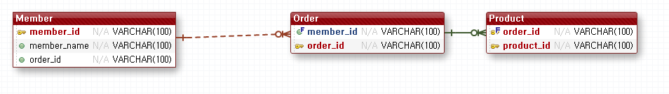
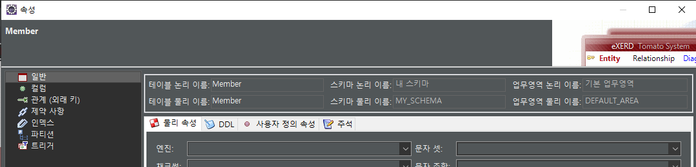
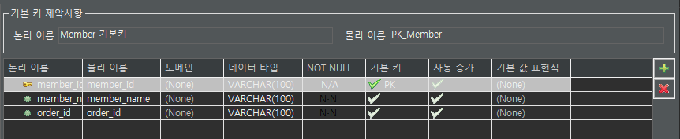
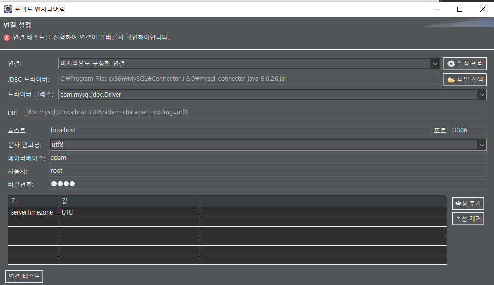

# eXERD를 이용한 실무에서의 데이터 모델링

수업 참고자료 : [https://ggangpae1.tistory.com/188](https://ggangpae1.tistory.com/188)


<details>
<summary>안녕하세요</summary>
<div markdown="1">

```python
from flask import Flask, request, render_template
# model.py 임포트
import model
```

</div>
</details>

## 1.실무에서의 데이터 모델링
- 모델링 도구를 이용
- 가장 많이 사용되는 도구는 ERWin입니다.
- 이번 실습에서는 무료로 사용할 수 있는 Eclipse Plug-In 중의 하나인 eXERD를 사용합니다.
- 포워드 엔지니어링과 리버스 엔지니어링 기능을 제공합니다. 
  - 포워드 엔지니어링 : 모델링후 테이블
  - 리버스 엔지니어링 : 테이블로부터 모델링 정보획득


## 2.준비 작업
### 1) 데이터베이스 설치
- 사용할 데이터베이스가 있어야 합니다.
  - 오라클을 설치할 경우
    -  Windows 나 Linux환경은 바로 다운로드 받아서 설치가 가능합니다
    -  Mac은 오라클 설치가 안되는데 Mac에서 오라클을 사용하고자 한다면 docker를 이용해서 오라클 이미지를 다운받아서 설치하면 됩니다. 
      나중에 프로그래밍 언어로 연동할 때도 Mac에서는 별도의 작업을 수행해야 합니다.
  - MySQL을 설치할 경우
    - Mysql community version을 설치하는데 8.X.X버전으로 설치해도 됩니다. *(2021-08-25기준)*
    - Windows에서 바로 다운로드 받아서 설치가 가능합니다
    - Linux에서는 명령어도 설치할 수 있는데 이 경우 기본적으로 Maria DB를 설치합니다.
    - Mac에서는 homebrew로 설치 가능합니다.  
      root계정의 비밀번호가 처음에 없는 형태로 설치됩니다.
    - 특정 소프트웨어에서는 비밀번호가 없으면 접속이 안되는 경우도 있습니다. 이 경우에는 비밀번호를 설정하던가 계정을 하나 추가해서 사용해야 합니다. 


### 2) Eclipse 플러그인 설치

### 3) eXERD 설치
- Eclipse에서 메뉴[Help] - [Install New Software] - Work with에  https://exerd.com/update/3.x/ 를 입력하여 eXERD설치후 Eclipse재실행


## 3.eXERD 기본 사용방법
- Java Project 생성 
  - 프로젝트명:dbmodeling
- src폴더안에 eXERD파일 생성
  - 파일명 : MySQL.exerd
- 하얀색 그리드에 [오른쪽 클릭] - [새로만들기] - [테이블 생성] 클릭
  - 테이블 명 : Member
  
  
- 그리드위에 생성된 Member테이블 우클릭-[특성] 클릭 - [일반] 탭
  - 테이블의 논리이름 또는 물리이름 변경가능
    - 논리이름 : 보여지는 이름
    - 물리이름 : 실제 데이터베이스에 저장되는 이름




- 그리드위에 생성된 Member테이블 우클릭-[특성] 클릭 - [컬럼] 탭
  - 컬럼 탭에서 컬럼추가 및 변경 가능
    - 논리이름 : 보여지는 이름
    - 물리이름 : 실제 데이터베이스에 저장되는 이름




## 4.포워드 엔지니어링 - 모델링 결과를 테이블로 변환

- 포워드 엔지니어링 : 모델링 -> 테이블

- 접속할 데이터베이스가 준비되어야 합니다

- 데이터베이스 설치드라이버가 준비되어야 합니다 (다운로드 받은 데이터베이스 드라이버)

- 메뉴에서 [eXERD] - [포워드 엔지니어링] - [Next] -  [Next] - [Next] -스키마가 보임

  - 스키마 이름
  
    - 오라클이면 계정이름
    - mysql이면 데이터베이스
  
  - 드라이버 선택 
  
  - 호스트 : localhost
  - 데이터베이스 : world
  - 사용자 : root
  - 비밀번호
  - 속성 추가 : serverTimezone UTC
  
  


- [eXERD] - [내보내기] - [SQLite Database]
  - SQLite Database를 자동을 내보낼 수 있습니다
  - 템플릿은 HTML이나 다른 것으로 만들 수 있습니다.


## 5. 리버스 엔지니어링 - 이미 만들어진 테이블을 E-R Diagram으로 추출

-  포워드 엔지니어링 : 테이블 -> E-R Diagram
   - 구현된 코드로부터 설계 정보를 만드는 것을 Reverse Engineering이라고 합니다
