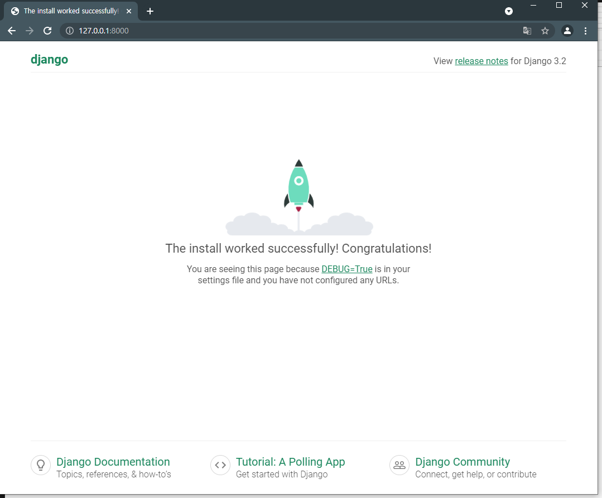
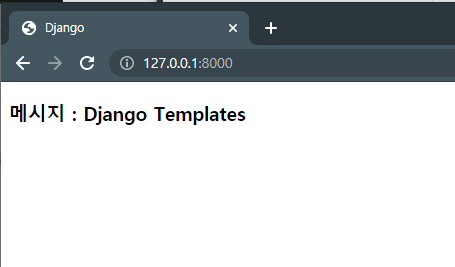

# Django Framework

- python의 Web Application Framework로 Framework자체가 Python으로 개발됨
- http://www.dhangoproject.com에서 정보를 제공
- 설치 : pip install Django


## 1.Djaongo의 특징

- Flask에 비해서 자유도가 떨어지기는 하지만 기본 템플릿을 제공하고 데이터베이스 연동도 ORM을 지원합니다.
- IDE는 Pycharm을 이용
- PyCharm은 기본적으로 파이썬과 pip만 설치된 가상환경을 이용해서 프로젝트를 생성 : 필요한 라이브러리는 직접 설치해야 합니다.
- 라이브러리 설치는 Pycharm터미널에서 pip를 이용해서 설치할 수 있고 환경 설정(윈도우즈에서는  File-Settings 이고 Mac에서는 메인 메뉴의 Preferences)에서 인터프리터를 선택해서 +버튼을 눌러서 가능


## 2.Applcitaion Desing Pattern(개발 방식)

- 모델,템플릿,  모듈 간에 독립성을 유지할 수 있고 소프트웨어 개발의 중요한 원칙인 느슨한 결합(Loose Coupling) 설계의 원칙에 부합
- 어느 하나의 변화가 다른 부분에 영향을 거의 주지 않음
- Front End 개발자, Back End 개발자, DB 설계자 간의 협업이 쉬워지면 유지보수도 편리

react와 vue의 목적은 서버의 데이터를 보여주기 위함. 요즘엔 node에 대한 얘기가 빠지지 않음


### 1) MVC(Model View Controller)

- Model : 데이터를 만들어 부분
- View : 클라이언트에게 보여주는 부분
- Controller: 사용자의 요청을 받아서 필요한 비지니스 로직을 호출하고 그 결과를 View에 전송하는 역할을 수행하는 부분


### 2) MVT(Model View Template)

- Application을 3개 영역으로 구별해서 개발을 진행
  - **Model** : 데이터를 만들어주는 부분
  - **View** : Controller의 역할
    - 어떤 요청이 오면 누구를 부를 것인가?
  - **Template** : 전통적인 모델의 View의 역할
    - 전달 받은 데이터를 어떻게 출력할 것인가? 

- 데이터를 정의하는 Model 그리고 사용자가 보게될 화면을 정의하는 Template 애플리케이션의 제어 흐름 및 처리 로직을 정의하는 View 3부분으로 나누어서 구현(Java에서 배우던 MVC의 View와는 다릅니다.)


### 3) MVVM(Model View ViewModel) - Mobile에서 사용

- Model : 데이터를 만들어주는 부분
- View : 데이터를 출력하는 부분
- ViewModel : View가 사용할 메소드와 필드를 구현하고 뷰에게 상태 변화를 알려주는 부분


## 3.Django 프로젝트 및 생성

- django-admin startproject 프로젝트이름
- django ./manage.py/startapp 애플리케이션 이름
  - 기본적인 틀을 만들어짐

### 1) pycharm에서 프로젝트 생성

- 메뉴[File]-[New Project] 
  djangoapp 로 pycharm 프로젝트 생성


### 2) Django 라이브러리 설치

- 메뉴[File] - [Settings] - [Interpreter] - [+] 클릭 하여 Django 패키지 설치


### 3) Pycharm 터미널에서 Django의 프로젝트를 생성

- [view] -[tool window]  - [terminal]에서 하단에 뜬 terminal창에 
  `django-admin startproject 프로젝트 이름`입력하여 설치

```PS C:\Users\admin\PycharmProjects\djangoapp> django-admin startproject mysite```


### 4) Pycharm터미널에서 Django애플리케이션을 생성

`python ./manage.py startapp 앱이름`으로 Django애플리케이션 생성을 하는데 경로가 없다고 뜨면 `cd mysite` 하여 경로 이동하기

```
PS C:\Users\admin\PycharmProjects\djangoapp> cd mysite
PS C:\Users\admin\PycharmProjects\djangoapp\mysite> python ./manage.py startapp mydjango
```


### 5) 실행방법

#### 1.터미널에서 실행

- 터미널에서 `python manage.py runserver IP주소:포트번호`
  - 포트번호를 생략하면 8000번이 되므로 ip주소를 생략해도 됨

```
PS C:\Users\admin\PycharmProjects\djangoapp\mysite> python manage.py runserver
```

기술마다 기본포트번호가 정해져있는데 기본포트번호를 설정하게 되면 애플리케이션이 어떤 기술로 만들어졌는지 알 수 있게 됩니다.

#### 2.pytcharm에서 실행

- manage.py 파일을 선택하고 마우스 오른쪽을 눌러서 [Modify Run Configuration]을 실행해서 Parameter에 runserver 라고 입력하고 다음부터는 manage.py파일을 실행하면 됩니다.


#### 3.IP주소

- 동일한 컴퓨터라면 브라우저에서 localhost:8000 으로 입력하면 됩니다. 
- 외부에서 접속이 가능한지 확인하고자 하면 자신의 컴퓨터에서 127.0.0.1:8000이라고 입력하면 되고 다른 컴퓨터에서 확인하려면 IP주소:8000이라고 입력하면 됩니다. 
- 집같은 곳에서는 wifie가 같거나 동일한 공유기로 연결된 경우에만 접속이 가능하고 외부에서는 접속이 안됩니다.
- 외부에서도 접속이 가능하도록 하고자 하면 외부 클라우드 환경(AWS, GCP, MS Azure, 더존 등)이나 Django와 Database를 지원해주는 웹 호스팅 업체에 업로드를 하거나 집에 있는 IP공유기의 포트포워딩을 설정하면 됩니다.


#### 4.실행하기

manage.py 파일을 선택하고 마우스 오른쪽을 클릭해서 Modify Run Configuration을 실행한 후 Parameters에 runserver라고 입력한 후 manage.py를 실행하면 아래와 같이 djago접속화면이 뜹니다.




### 6) 지금까지의 프로젝트 구조

```
djangoapp 										# pycharm프로젝트
├── 📁mysite									# 프로젝트
|	├──📁mydjango								# 애플리케이션
|	|	└──────📁migrations
|	|		├──📃__init__.py					# 맨처음에 호출되는 파일
|	|		├──📃admin.py
|	|		├──📃apps.py						# 애플리케이션 설정 파일
|	|		├──📃models.py						# DB 매핑 클래스 생성파일
|	|		├──📃tests.py
|	|		└──📃views.py						# 요청에 응답하는 메소드들을 정의하는 파일
|	├──────📁mysite								# django의 프로젝트
|	|	├──📃__init__.py						# 맨처음에 호출되는 파일
|	|	├──📃asgi.py
|	|	├──📃settings.py						# 프로젝트 설정 파일. 모든 설정이 이루어짐
|	|	├──📃urls.py							# 클라이언트의 요청에 응답하는 메소드를 설정
|	|	└──📃wsgi.py
|	├───📃db.sqlite3							# sqlite 데이터베이스 사용을 위한 파일
|	└───📃manage.py								# 프로젝트 실행 파일. 수정하지 않음
├───📃main.py
├───📃controller.py
└───📃model.py
```

- Library : 자체적으로 실행하지는 않고 다른 Application이 편리하게 작업할 수 있도록 도와주는 파일이나 Application

- manage.py : 프로젝트 실행 파일 - 수정하지 않음

- db.sqlite3 : sqlite 데이터베이스 사용을 위한 파일.

  -  sqlite를 사용하지 않는다면 삭제 가능한데 처음부터 지우면 실행이 안됨

- sqlite : 관계형 데이터베이스(RDMBS)인데 로컬에서만 사용이 가능한 데이터베이스이며 파이썬이나 웹브라우저 안에서는 별도의 설치없이 사용가능하며 IOS와 Android에도 기본적으로 탑재되어 있습니다. 임시 저장을 위해서 사용합니다.

  - 왜 sqlite를 사용해야 하는가 ? 

    - 모든 데이터를 서버에 두는 것이 보안상 유리하고 백업에도 유리하지만 모든 데이터를 서버에서 불러온다면 애플리케이션의 속도가 느려집니다.

    - 자주 사용하는데 보안이 중요하지 않은 데이터는 로컬에 저장해두고 변경이 생길때만 업데이터해서 사용하는 방식을 많이 취합니다.

    - 트래픽 때문에 이렇게 구현하는 경우가 있습니다.

      클라이언트 <--> 클라우드 <--> 서버 애플리케이션


### 

### 프로젝트

여러 개의 Application이나 라이브러리를 관리하기 쉽도록 묶어주는 역할 - 디렉토리와 유사한 개념


#### 📃\__init__.py : 

- 디렉토리 안에 이 파일이 들어있으면 이파일의 내용이 가장 먼저 수행됩니다. 이 파일이 존재하면 이디렉토리는 패키지가 됩니다. 초기화 작업하는 내요을 추가합니다.


#### 📃settings.py

프로젝트 설정 파일로 데이터베이스나 url 그리고 각종 디렉토리를 설정합니다.

- 사용 애플리케이션 등록

```python
# 사용중인 애플리케이션을 등록하는 부분
INSTALLED_APPS = [
    'django.contrib.admin',
    'django.contrib.auth',
    'django.contrib.contenttypes',
    'django.contrib.sessions',
    'django.contrib.messages',
    'django.contrib.staticfiles',
]
```


- node에도 중간처리 과정이 있습니다

```python
# 중간 처리를 위한 설정
MIDDLEWARE = [
    'django.middleware.security.SecurityMiddleware',
    'django.contrib.sessions.middleware.SessionMiddleware',
    'django.middleware.common.CommonMiddleware',
    'django.middleware.csrf.CsrfViewMiddleware',
    'django.contrib.auth.middleware.AuthenticationMiddleware',
    'django.contrib.messages.middleware.MessageMiddleware',
    'django.middleware.clickjacking.XFrameOptionsMiddleware',
]
```


- 템플릿 설정 항목

```python
# 템플릿 설정 항목
# 보통 기본으로 두고 사용하며 필요하면 DIRS만 수정합니다.
# VIEW파일에 있는 디렉토리를 설정할 수 있습니다.
TEMPLATES = [
    {
        'BACKEND': 'django.template.backends.django.DjangoTemplates',
        'DIRS': [],
        'APP_DIRS': True,
        'OPTIONS': {
            'context_processors': [
                'django.template.context_processors.debug',
                'django.template.context_processors.request',
                'django.contrib.auth.context_processors.auth',
                'django.contrib.messages.context_processors.messages',
            ],
        },
    },
]
```


- 데이터베이스 접속 부분

기본은 sqlite3로 연결

```python
# 데이터베이스 접속 부분
# 기본은 sqlite3로 연결
# Database
# https://docs.djangoproject.com/en/3.2/ref/settings/#databases

DATABASES = {
    'default': {
        'ENGINE': 'django.db.backends.sqlite3',
        'NAME': BASE_DIR / 'db.sqlite3',
    }
}
```


- 인증 관련 부분

```python
# 인증 관련 부분
# Password validation
# https://docs.djangoproject.com/en/3.2/ref/settings/#auth-password-validators

AUTH_PASSWORD_VALIDATORS = [
    {
        'NAME': 'django.contrib.auth.password_validation.UserAttributeSimilarityValidator',
    },
    {
        'NAME': 'django.contrib.auth.password_validation.MinimumLengthValidator',
    },
    {
        'NAME': 'django.contrib.auth.password_validation.CommonPasswordValidator',
    },
    {
        'NAME': 'django.contrib.auth.password_validation.NumericPasswordValidator',
    },
]
```


- 타임존은 기본이 UTC인데 주석처리해 놓고 Asia/Seoul을 설정해놓습니다.

```python
# 언어
LANGUAGE_CODE = 'en-us' 

# 타임존
#TIME_ZONE = 'UTC' 
TIME_ZONE = 'Asia/Seoul'
```


- static 파일 경로


```python
STATIC_URL = '/static/' 
```


#### 📃urls.py

-  클라이언트의 요청에 응답하는 메소드를 설정


### Application

서비스를 제공하는 단위로 출력부분에 해당합니다


#### 📃apps.py

- 애플리케이션 설정 파일. 수정하지 않습니다.


#### 📃models.py 

- 관계형 데이터베이스와 매핑될 클래스를 생성하는 파일. ORM설정


#### 📃views.py 

- 요청에 응답하는 메소드들을 정의하는 파일. urls.py와 Controller의 역할을 수행
  중급 이상의 개발자는 클래스를 만들어서 메소드를 구분하는 경우가 많음.

- 모든 요청에 대해 클래스로 나누지 않고 메소드로 구분하면 너무 많은 메소드가 만들어집니다. 그래서 클래스를 만들어 용도별로 나누는 것이 좋습니다.


#### 📃urls.py

url매핑과 관련된 파일

admin이면 다음 메소드를 수행하라는 의미  

📁mysite/📁mydjango/📁mysite/📃urls.py

```python
urlpatterns = [
    path('admin/', admin.site.urls),
]
```


## 4. 요청이 오는 경우 처리하는 방법

장고와 플라스크의 가장 큰 차이가 플라스크는 하나의 프로젝트에 하나의 애플리케이션이 들어갈 수 있지만 장고는 하나의 프로젝트에 여러개의 애플리케이션이 들어갈 수 있습니다.


### 1) 모든 요청을 처리하는 메소드를 작성

#### 📃views.py : 요청에 대한 처리 관련 메소드

- 요청에 대한 처리 관련 메소드가 존재하는 파일
- 메소드 이름은 개발자가 아무거나 사용할 수 있는데 ulrs.py에 정확하게 지정을 해야 합니다.

- 요청에 대해서 메소드를 지정하려면 📃views.py 에 메소드를 만들고 📃ulrs.py에 매핑시켜주면 됩니다.

- views.py 파일에 요청 처리 메소드를 생성

📁mysite/📁mydjango/📃views.py

```python
from django.shortcuts import render
from django.http import HttpResponse

# 응답을 처리하는 메소드
def index(request):
    # 직접 응답을 생성
    return HttpResponse('<h1>Hello Django</h1>')
```


#### 📃settings.py : 프로젝트 설정 파일

- settings.py 파일의 INSTALLED_APPS 항목에 자신의 애플리케이션 이름을 등록
- 여러 개를 등록할 수 있는 경우라면 이 순서가 찾아가는 순서입니다.

📁mysite/📁mysite/📃settings.py

```python
INSTALLED_APPS = [
    'django.contrib.admin',
    'django.contrib.auth',
    'django.contrib.contenttypes',
    'django.contrib.sessions',
    'django.contrib.messages',
    'django.contrib.staticfiles',
    'mydjango',
]
```


#### 📃urls.py : 요청과 메소드를 연결

- $는 모든 url에 대해서 반응합니다. 어떤 요청이든 요청이 오면 `views.index`메소드를 호출합니다.
- http://127.0.0.1:8000/ 뒤에 어떤 파라미터를 지정하여도 응답결과는 같습니다.

📁mysite/📁mydjango/📁mysite/📃urls.py

```python
from django.contrib import admin
from django.urls import path
from django.conf.urls import url
from mydjango import views

urlpatterns = [
    # 모든 요청이 오면 views.py의 index라는 메소드를 호출한다는 의미
    url('$', views.index),
]
```


## 5.View Template

- 클라이언트에게 응답을 하기 위해서 HttpResponse를 사용
- 출력할 내용이 작으면 HttpResponse에 직접 작성하는 것이 가능합니다
- 많은 양의 내용을 출력하고자 하는 경우 HttpResponse를 이용하면 문자열 리터럴의 길이가 너무 길어져서 불편합니다.
- View Template 기능을 제공해서 요청을 처리하는 메소드에서 파일의 경로와 데이터를 render객체로 만들어서 리턴하면 templates 디렉토리에서 찾아서 출력을 할 수 있도록 합니다.
- 이 때 클라이언트로부터 넘겨받은 request를 같이 전달합니다.


[포워딩(Forwarding) / 리다이렉트(Redirect) 차이점](https://junhyunny.blogspot.com/2019/12/forwarding-redirect.html)


### 1) View

- 다른 MVC Framework에서는 Controller의 역할을 수행
- 요청이 오면 적절한 모델 또는 서비스를 호출해서 작업을 수행한 후 결과를 받아서 가공을 하고 응답을 전송하는 역할을 수행
- 요청이 처리하는 단위는 메소드이고 이 메소드의 매개변수는 일반적으로 HttpRequest 하나이고 리턴하는 데이터는 HttpResponse입니다.
- HttpResponse로는 복잡한 응답을 만들기가 어려워서 Template를 사용합니다.


#### 📃views.py 의 요청을 처리하는 메소드를 수정

📁mysite/📁mydjango/📃views.py

```python
from django.shortcuts import render
from django.http import HttpResponse

# 응답을 처리하는 메소드
def index(request):
    # 직접 응답 생성
    # return HttpResponse('Hello Django')

    # ViewTemplate 기능 사용
    msg = 'Django Templates'
    # teimplates 디렉토리의 index.thml로 출력하고
    # message라는 데이터에 내용을 전달
    # dict형태로 값을 반환해줌
    return render(request, 'index.html', {'message':msg})
```


#### 📃index.html생성

애플리케이션 디렉토리 안에 📁templates 디렉토리를 생성하고 그 안에 📃index.html파일을 만들고 message를 출력하는 코드를 작성합니다.

📁mysite/📁mydjango/📁templates/📃index.html

```html
<!DOCTYPE html>
<html lang="en">
<head>
    <meta charset="UTF-8">
    <title>Django</title>
</head>
<body>
    <h3>메시지 : {{message}}</h3>
</body>
</html>
```


📁templates 디렉토리를 새로 생성했으므로 서버를 중지하고 다시 시작해야 합니다.




## 6.Template

- 다른 MVC Framework에서는 View의 역할을 수행
- View가 전송한 데이터를 출력하는 역할을 수행합니다.
- 앱 디렉토리 밑에 📁Templates라는 디렉토리를 생성해서 그 안에 템플릿 파일을 생성하는 구조로 사용합니다.
- 템플릿 파일을 이용하고자 할 때는 View에서 render 객체를 이용해서 request와 템플릿 파일 이름 그리고 넘겨줄 데이터를 dict로 생성해 주면 됩니다.
- Template 언어라고 부르는 부분이 html파일에 서버의 데이터를 출력하기 위한 문법을 의미합니다. 
- html에 java문법으로 이 부분을 작성하면 jsp입니다.
- c#문법으로 이 부분을 작성하면 asp.net이라고 합니다
- php는 별도의 문법이 있는데 이 문법이 c와 유사합니다.


### 1) 데이터 사용

`{{데이터 이름을 파이썬처럼 사용하면 됩니다}}`


### 2) 분기문(조건 - condition) 사용

``로 시작하여 ``로 끝을 맺어야 합니다.

```django

​			if 조건이 True를 리턴할 때 수행할 내용 작성

			elif 조건이 True를 리턴할 때 수행할 내용 작성

			수행할 내용 작성

```


### 3) 반복문(Loop, Iteration) 사용

``로 시작하여 ``로 끝을 맺어야 합니다.

```django

			반복수행할 내용

```


### 4) 서식 설정

- 날짜의 경우

`{{데이터 | date : 날짜서식}`

- 문자열의 경우

`{{데이터 | 적용할 메소드 이름}}`


### 5) 주석(comment)

```django

	주석

```


## 7.Model

- 데이터 서비스를 제공하는 Layer

- Application마다 기본적으로 생성되는 models.py 모듈 안에 정의

- 여러 개의 클래스를 작성할 수 있고 하나의 클래스는 하나의 테이블에 해당됩니다.

- 이 클래스는 django.db.models.Model 의 파생(상속받은) 클래스입니다.

- 이 클래스에 정의된 각 속성은 테이블에서 하나의 Field(Attribute, Column)

  - Primary Key를 지정하지 않으면 테이블을 만들때 자동으로 id라는 Field가 생성됩니다.

  - 데이터베이스 자료형에 따라 여러가지 필드 속성이 정의되어 있습니다.

    [❗기존 관계형 데이터베이스의 문제점]()

- 유효ID
  - 노트북과 핸트폰의 유효ID를 알고 있으면 찾을 수 있음
- 제약 조건
  - Swift나 Java Kotlin에서 ?나 !로 Optional을 표현합니다.


### 1) 📃settings.py 설정

- 📃settings.py파일에 사용할 데이터베이스 설정을 하고  📁mysite/📁mydjango/📃models.py에 사용할 테이블의 클래스를 설정합니다.
- 연결 내용에 변경이 생기면 터미널에 2개의 명령을 수행합니다.

```
PS C:\Users\admin\PycharmProjects\djangoapp\mysite> python manage.py makemigrations
```
```
PS C:\Users\admin\PycharmProjects\djangoapp\mysite> python manage.py migrate
```

수정한 내용이 데이터베이스에 반영

테이블을 만들 필요가 없습니다


## 8.MySQL 데이터베이스 연결 설정

설계를 먼저했다면 models.py를 먼저 수정하고 데이터베이스를 먼저 만들었다면 

### 1) mysqlclient패키지 설정

- 메뉴[File] - [Settings] - [Interpreter] - [+] 클릭 하여 mysqlclient 패키지 설치

  (Oracle은 oracleclient 패키지 설치)


### 2) 📃settings.py : DB정보 설정

📁mysite/📁mysite/📃settings.py

```python
DATABASES = {
    'default': {
        'ENGINE': 'django.db.backends.mysql',	# 사용할 DB
        # 'NAME': BASE_DIR / 'db.sqlite3',
        'NAME' : 'adam',	# 데이터베이스이름
        'USER' : 'root',	# 아이디
        'PASSWORD' : '1234',	# 비밀번호
        'HOST' : 'localhost',	# 데이터베이스위치
        'POST' : '3306'	# 포트번호
    }
}
```


### 4) 샘플 데이터 작업

- 테이블 이름은 자신의 `App이름_테이블이름`으로 짓습니다.

[데이터베이스 준비작업](https://github.com/2SEHI/K-Digital_Lecture/blob/main/0825_eXERD%2C%20Web/Web%20Programming.md#3mysql-%EC%97%B0%EB%8F%99)

Mysql 에서 아래의 sql을 실행시켜 테이블과 데이터 만들어 놓기

```mysql
show databases;

create table mydjango_item(
	itemid int,
	itemname varchar(20),
	price int,
	description varchar(50),
	pictureurl varchar(20),
	primary key(itemid)
);

insert into mydjango_item
(itemid,itemname, price, description, pictureurl)
values(1, 'Lemon',500, 'Vitamin-A', 'lemon.jpg');

insert into mydjango_item
(itemid,itemname, price, description, pictureurl)
values(2, 'Orange',1500, 'Vitamin-B', 'orange.jpg');

select * from mydjango_item;
```


### 5) 📃models.py : 테이블과 연동할 클래스 생성

이 때 생성되는 테이블의 이름을 `Appliction이름_Model클래스이름` 의 형식으로 생성합니다.

mydjango가 애플리케이션 이름이고 아래에 📃models.py에 생성한 클래스 이름이 Item이므로 

mydjango_item 테이블 과 연동하게 됩니다. 이 방식이 ORM방식입니다.

📁mysite/📁mydjango/📃models.py

```python
from django.db import models

# myjango_item 테이블과 연동할 클래스
class Item(models.Model):
    # id는 숫자를 문자열로 바꾸기
    itemid = models.CharField(max_length=50, primary_key = True)
    itemname = models.CharField(max_length=50)
    price = models.IntegerField()
    description = models.CharField(max_length=50)
    pictureurl = models.CharField(max_length=50)
```


### 6) CRUD 작업 방법

- Model 클래스에 objects 라는 Manager객체를 자동으로 추가

#### - 검색

- **전체 데이터 가져오기** : `objects.all()`을 호출하면 테이블의 모든 데이터에 접근할 수 있는 iterator를 반환하고 iterator를 순회하면 Model클래스의 객체가 리턴됩니다. 이 객체를 이용해서 각 필드에 접근하면 됩니다.
   `objects.all()`
- **하나의 데이터 가져오기** : primary key를 이용해서 하나의 데이터만 찾아오고자 하는 경우 
  `objects.get(pk=값)`
- **조건에 맞는 데이터만 가져오기** : 
  `obejects.filter(컬럼이름 = 조건)`
- **조건에 맞는 데이터만 제외** : 
  `objects.exclude(컬럼이름 = 조건)`
- **데이터 개수 가져오기** :
  `objects.count()`
- 이외에 `order_by()`, `distinct()`,` first()`,` last()` 등의 메소드를 제공


#### - 삽입

- 데이터 삽입은 Model 클래스의 객체를 생성하고 객체가 `save()`라는 메소드를 호출하면 됩니다. insert sql문과 같이 데이터 삽입이 됩니다.


#### - 수정

- 데이터 수정은 검색된 데이터를 가지고 필요한 속성을 수정한 후 `save()`메소드를 호출하면 됩니다.


#### - 삭제

- 데이터 삭제는 검색된 데이터를 가지고 `delete()`를 호출하면 됩니다.


## 9.전체 목록 페이지 구현

### 1) 📃views.py : 요청에 대한 처리 관련 메소드

📁mysite/📁mydjango/📃views.py

````python
from django.shortcuts import render
from django.http import HttpResponse
from mydjango.models import Item
# 응답을 처리하는 메소드
def index(request):

    # 데이터베이스로부터 전체 데이터를 가져오기
    data = Item.objects.all()
    # 데이터가 제대로 불러지는 지 확인
    # 데이터가 제대로 불러지지 않으면 데이터베이스와 settings.py, models.py를 확인해야 합니다.
    print(data)
    # html에 출력
    return render(request, 'index.html', {'data' : data})
````


### 2) 📁static폴더 생성

- 📁static 파일 : 내용이 동적으로 변경되지 않는 파일 - 이미지나 동영상, css, js 등

-  css 적용을 위해서 📁app 디렉토리에 static이라는 디렉토리를 만들고 생성합니다
- 📃settings.py 파일에 디렉토리 경로를 설정해줍니다.
- html 파일에 로 사용합니다.


📁app 디렉토리(mydjango) 밑에 📁static/📁css 디렉토리를 생성하고 📃style.css파일을 생성하여 적용할 css스타일을 작업합니다.

📁mysite/📁mydjango/📁static/📁css/📃style.css

```css
div.body {
    margin-top:50px;
    margin-bottom:50px;
}

tr.header{
    background: #C9BFED;
}

tr.record{
    background: #EDEDED;
}
```


### 3) 📁static폴더 연결

📃settings.py 에 📁static폴더를 연결하는 처리를 추가해줍니다.

📁mysite/📁mysite/📃settings.py

```python
import os
STATICFILES_DIRS = [
    os.path.join(BASE_DIR, '../static')
]
```


### 4) 📃index.html : 출력수정

📃index.html파일을 수정해서 📁static파일도 설정하고 데이터도 출력합니다.


- static파일을 load할 수 있도록 html 최상단에 아래 코드를 추가해줍니다.

📁mysite/📁mydjango/📁templates/📃index.html

```html

```


- body태그 안에 상품목록을 표시하는 처리를 추가해줍니다.

📁mysite/📁mydjango/📁templates/📃index.html

```html
<body>
    <div align="center" class="body">
        <h3>상품 목록 화면</h3>
        <table border ='1'>
            <tr class="header">
                <th align="center" width="80">ITEMID</th>
                <th align="center" width="320">ITEMNAEM</th>
                <th align="center" width="100">PRICE</th>
            </tr>
            
            <tr class="header">
                <td align="center" width="80">{{item.itemid}}</td>
                <td align="center" width="320">{{item.itemname}}</td>
                <td align="right" width="100">{{item.price}}</td>
            </tr>
            
        </table>
    </div>
</body>
```


## 10.상세보기 구현


- body태그 안에 상품목록을 표시하는 처리를 추가해줍니다.

📁mysite/📁mydjango/📁templates/📃index.html

```html
<body>
    <div align="center" class="body">
        <h3>상품 목록 화면</h3>
        <table border ='1'>
            <tr class="header">
                <th align="center" width="80">ITEMID</th>
                <th align="center" width="320">ITEMNAEM</th>
                <th align="center" width="100">PRICE</th>
            </tr>
            
            <tr class="header">
                <td align="center" width="80">{{item.itemid}}</td>
                <td align="center" width="320">
                    <a href="detail/{{item.itemid}}">{{item.itemname}}
                    </a>
                </td>
                <td align="right" width="100">{{item.price}}</td>
            </tr>
            
        </table>
    </div>
</body>
```


### 1) 📃urls.py : 요청과 메소드를 연결

모든 요청에 대해 views.index메소드를 호출하고 있던 것을 특정 요청에 대한 메소드 호출 처리로 변경


📁mysite/📁mydjango/📁mysite/📃urls.py

```python
from django.urls import path
from mydjango import views

urlpatterns = [
    path('', views.index),
    # detail로 시작하는 요청이 오면 views.detail메소드가 처리하고
    # 그 뒷부분은 정수로 변경해서 itemid에 저장해서 전달합니다.
    path('detail/<int:itemid>', views.detail)
]
```


### 2) 📃views.py : 요청 처리 메소드 생성

📃views.py 파일에 detail 요청을 처리하기 위한 detail 메소드를 생성합니다.

📁mysite/📁mydjango/📃views.py

```python
def detail(request, itemid):
    item = Item.objects.get(itemid = itemid)
    return render(request, 'detail.html', {'item':item})
```


### 3) 📁static : 이미지 파일 넣기

📁static디렉토리 아래에 img폴더와 이미지파일을 넣습니다.


### 4) 📃detail.html : 출력

📃detail.html파일을 생성하여 테이블의 상세 내용을 출력할수있도록 합니다


- static디렉토리의 이미지파일을 load할 수 있도록 html 최상단에 아래 코드를 추가해줍니다.

📁mysite/📁mydjango/📁templates/📃detail.html

```html

```


📁mysite/📁mydjango/📁templates/📃detail.html

```html
<body>
<table>
  <tr>
    <th>ITEMNAME</th>
    <td>{{item.itemname}}</td>
  </tr>
  <tr>
    <th>PRICE</th>
    <th>{{item.price}}</th>
  </tr>
  <tr>
    <th>DESCRIPTION</th>
    <th>{{item.description}}</th>
  </tr>
  <tr>
    <th>PICTUREURL</th>
    <th></th>
  </tr>
</table>
<a href="../">목록으로 돌아가기</a>

</body>
```


## 11.데이터 삽입 처리

- 파일 업로드가 있는 경우와 없는 경우로 나뉩니다.
- 파일을 업로드 했더라도 이 파일을 html파일에서 사용하느냐 그렇지 않느냐로 구분을 합니다
- 업로드한 페일을 사용하는 경우에는 프로젝트 디렉토리에 업로드할 파일을 저장할 디렉토리를 생성해야 합니다.

- model을 만들 때 업로드할 파일이 있는 경우 FileField로 만들어주면 됩니다.


### 1) 데이터베이스에서 테이블 삭제

- 데이터베이스 접속 프로그램에서 실행한 경우
  - `drop table 테이블이름`를 실행하여 테이블을 삭제합니다.

```sql
drop table mydjango_item;
```


### 2) 📃models.py : 파일의 Item클래스를 수정

업로드할 세부 디렉토리이름과 null 여부를 설정합니다.

```python
# myjango_item 테이블과 연동할 클래스
class Item(models.Model):
    # 숫자를 문자열로 바꾸기
    itemid = models.CharField(max_length=50, primary_key = True)
    itemname = models.CharField(max_length=50)
    price = models.IntegerField()
    description = models.CharField(max_length=50)
    pictureurl = models.ImageField(upload_to = 'images/',blank=True, null=True)

```


### 

- - 

  - $는 모든 url에 대해서 반응합니다. 어떤 요청이든 요청이 오면 `views.index`메소드를 호출합니다.
  - http://127.0.0.1:8000/ 뒤에 어떤 파라미터를 지정하여도 응답결과는 같습니다.

  ```python
  from django.contrib import admin
  from django.urls import path
  from django.conf.urls import url
  from mydjango import views
  
  urlpatterns = [
      # 모든 요청이 오면 views.py의 index라는 메소드를 호출한다는 의미
      url('$', views.index),
  ]
  ```


### 3) 📃models.py : 테이블 설정을 DB에 적용

📃models.py파일의 변경 내용을 적용합니다

- 터미널에서 `python manage.py`을 실행합니다.

- 📃settings.py파일에 사용할 데이터베이스 설정을 하고  📁mysite/📁mydjango/📃models.py에 사용할 테이블의 클래스를 설정합니다.
- 연결 내용에 변경이 생기면 터미널에 2개의 명령을 수행합니다.

```
PS C:\Users\admin\PycharmProjects\djangoapp\mysite> python manage.py makemigrations
```


```
PS C:\Users\admin\PycharmProjects\djangoapp\mysite> python manage.py migrate
```

- 이미지 파일을 사용한 경우 Pillow라는 패키지를 사용해야 합니다.

- 테이블을 만들 필요 없이 테이블이 데이터베이스에 생깁니다.


### 4) 📃settings.py : 업로드할 디렉토리 설정

📃settings.py파일에 파일 업로드 경로를 설정

```python
MEDIA_URL = '/media/'
MEDIA_ROOT = os.path.join(BASE_DIR,'mdeda')
```


프로젝트생성 및 프로젝트

📁mysite디렉토리 밑에 📁media폴더를 생성하는데 📃db.sqlite3와 📃manage.py하고 같은 라인이어야 합니다.


### 5) 📃index.html

body안에 아래 데이터 삽입 링크를 추가합니다. url을 추가할 때는 작업내용을 알 수 있도록 합니다.

```html
<p><a href="insert">데이터 삽입></a></p>
```


### 6) 📃urls.py : 요청과 메소드를 연결

- path설정을 추가합니다

📁mysite/📁mydjango/📁mysite/📃urls.py

```python
from django.conf.urls.static import static
from django.conf import settings
from django.contrib import admin
from django.urls import path
from django.conf.urls import url
from mydjango import views
urlpatterns = [
    # 모든 요청이 오면 views.py의 index라는 함수를 호출한다는 의미
    # url('$', views.index),

    path('', views.index),
    # detail로 시작하는 요청이 오면 views.detail함수가 처리하고
    # 그 뒷부분은 정수로 변경해서 itemid에 저장해서 전달합니다.
    path('detail/<int:itemid>', views.detail),
    path('insert', views.insert),
] + static(settings.MEDIA_URL, document_root = settings.MEDIA_ROOT)

```


### 7) 📃views.py : 요청에 대한 처리 관련 메소드

요즘 삽입에서 get요청으로 호출하고 post요청을 실제 작업을 수행하는데 이 처리 방식으로 인해 페이지 이동이 적습니다.


📁mysite/📁mydjango/📃views.py

```python
# get방식과 post방식을 나누어서 처리
def insert(request):
    if request.method == 'GET':
        GET 방식의 처리 - 페이지 이동
    else :
        POST방식의 처리 - 작업
```

